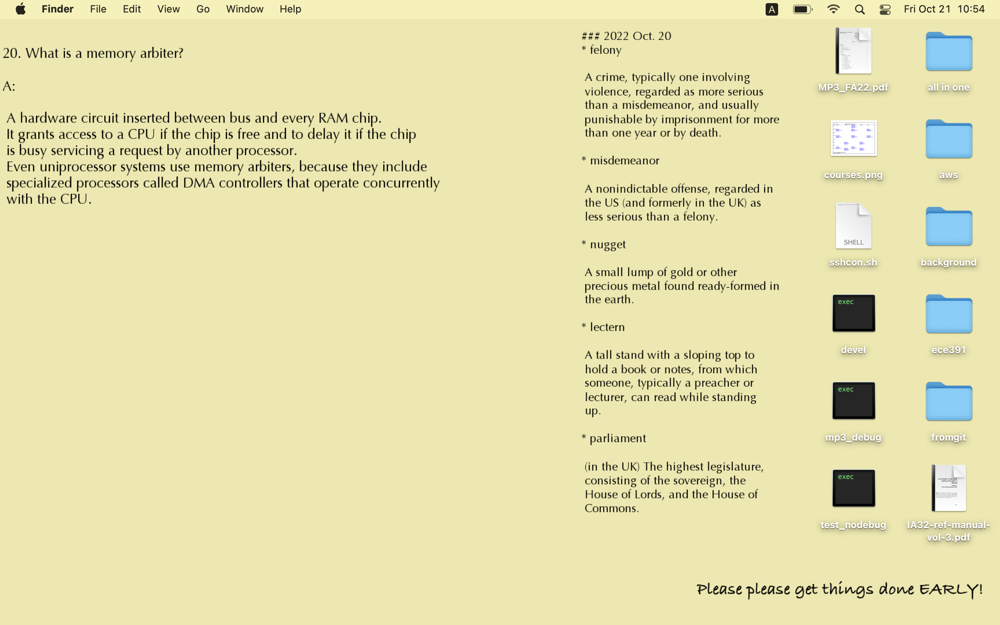

# DesktopBackgroundGenerator
Some scripts to generate my desktop background

## How it looks


## How to Use 
1. Make sure you have python installed
2. Install python library Pillow

```pip install Pillow```

3. Modify files in texts folder but keep the splitting symbols(triple dash) between different sections
4. Set the OS to have its desktop background picked randomly in the ```pic``` folder here
5. Each time you want to have a new set of images, run ```python generator.py``` here

### On Mac
I personally use macbook pro 13 inch when developing this tiny tool. 

My way of setting desktop image is to go to ```system preferences->Desktop & Screen Saver``` and use "+" symbol to add a new folder, the path should just be the ```[path to this folder]/pic```. Then enable "Change picture" and "Random order".

Note that each time you generate a new set of pictures, you'd have to reopen this desktop setting and re-choose this folder to let your mac know the update!!

My text location settings for the desktop image are kinda personal, you'd probably have to manuall change some of them for it to fit your desktop. Change them at the beginning of ```generator.py```, mine looks like:

	# general settings
	width = 1920
	height = 1080
	num_pics = 10
	num_vocs = 10
	qa_x = 100
	qa_y = 50
	voc_x = 1100
	voc_y = 50
	greet1_x = 1300
	greet1_y = 1000

	qa_font = ImageFont.truetype("Optima.ttc", size = 24)
	voc_font = ImageFont.truetype("Optima.ttc", size = 20)
	greet1_font = ImageFont.truetype("Bradley Hand Bold.ttf", size = 30)

### On Windows 
I believe the only difference is how you set the folder as a desktop image folder in windows.
